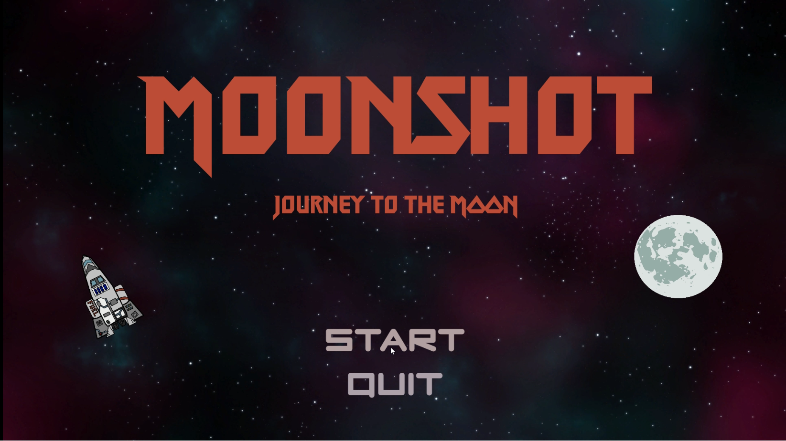
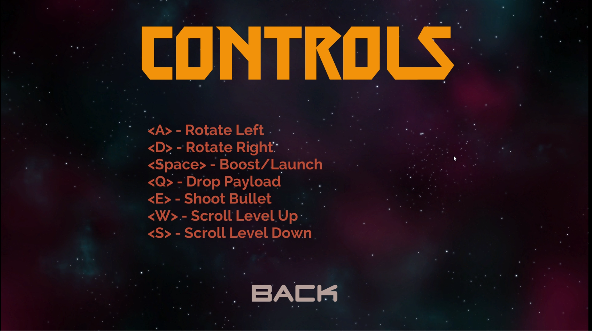
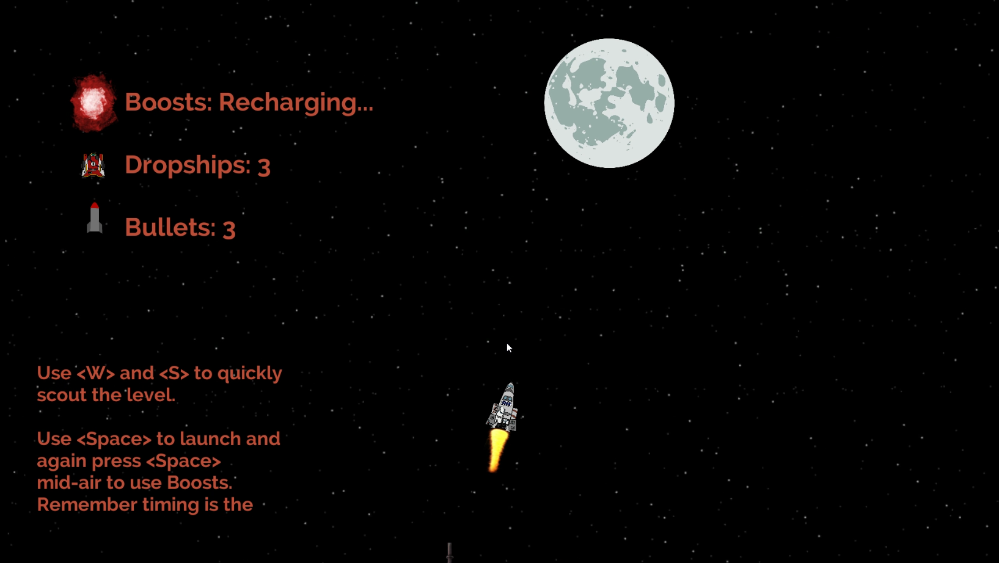
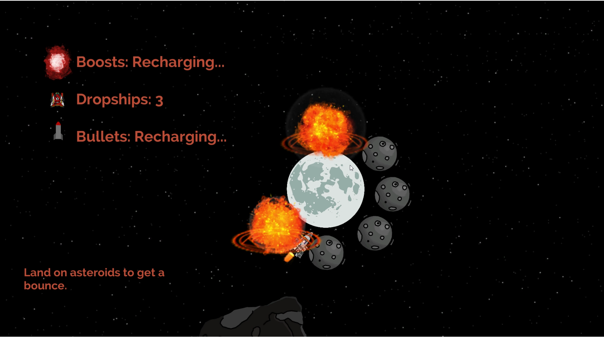
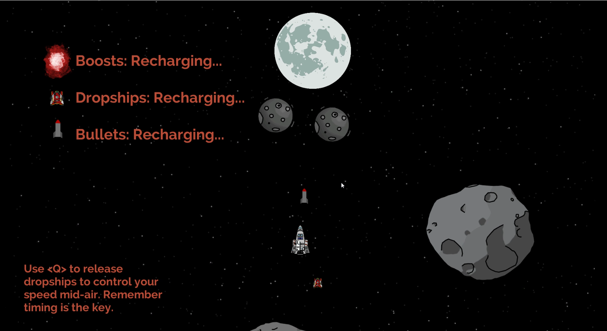

# Moonshot

This game is a submission for Github [Game-off 2020](https://itch.io/jam/game-off-2020) with the theme **Moonshot**. The 
project’s Github URL is: https://github.com/pc9795/moonshot

You have to land a Rocket on Moon fighting against gravity, bouncing off asteroids and destroying/avoiding obstacles. 
This game gives a player three abilities: Bullets, Dropships, and Boosts. Bullets are used to destroy certain 
destructible objects; Dropships are used to control your speed mid-air and Boosts are to increase your speed.

There are no difficulty settings right now but I consider this game to be between normal to hard difficulty. As Rocket 
will have no velocity and it will depend on the initial launch velocity and the mid-air boosts, it's all about timing.

Hope you enjoy this game.

 